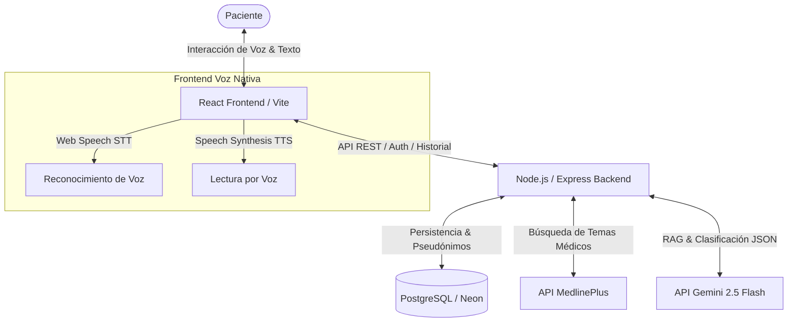

# ⚕️ VitalBot — Sistema de Orientación Médica Inteligente

VitalBot es un orientador virtual de salud diseñado para asistir a pacientes en la identificación de síntomas y nivel de riesgo médico mediante inteligencia artificial y fuentes de información clínica verificadas. La aplicación consta de una arquitectura desacoplada con un backend en Node.js/Express y un frontend en React (Vite).

---

## 🏗️ Arquitectura del Sistema

El siguiente diagrama muestra el flujo de datos e integración de componentes en VitalBot:



---

## 🚀 Características Clave

### 1. Motor RAG (Retrieval-Augmented Generation) Clínico
* **API de Gemini 2.5 Flash**: Utiliza el modelo `gemini-2.5-flash` mediante la versión de API `v1beta`.
* **Inyección de Contexto Dinámico**:
  - **MedlinePlus RAG**: Busca información oficial en la API de MedlinePlus. El backend detecta heurísticamente síntomas específicos en la entrada del usuario para buscar por palabra clave precisa (ej: *"cefalea"* en lugar del texto completo del chat), optimizando las fuentes retornadas.
  - **Base de Datos Local**: Inyecta los síntomas y reglas médicas activas registradas por los administradores.
* **Salida Estructurada Rígida**: Gemini responde con un esquema JSON preciso que define la respuesta médica, el nivel de riesgo (`Bajo`, `Medio`, `Alto`), la recomendación sintética y los IDs de síntomas mapeados.

### 2. Privacidad de Datos y Pseudónimos
* **Anonimización**: Con el fin de proteger el historial clínico del paciente bajo normativas de privacidad médica, los chats no se asocian de forma directa a la identidad real del usuario en las tablas de consultas. Se genera un pseudónimo único (formato aleatorio `Paciente-XXXX`) vinculado al ID de usuario en una tabla intermedia protegida.

### 3. Fallback Heurístico Local
* Si la clave API de Gemini no está configurada, falla o se agota su cuota, el backend activa automáticamente un motor heurístico local basado en coincidencias exactas de síntomas en la base de datos y reglas predefinidas, garantizando la disponibilidad del bot.

### 4. Interacción por Voz Nativa (STT y TTS)
* **Speech-to-Text (STT)**: Dictado en tiempo real en español (`es-CO`) utilizando la API nativa `SpeechRecognition` del navegador.
* **Text-to-Speech (TTS)**: Lectura fluida en español (`es-ES`) de la orientación del bot a través de `window.speechSynthesis`. El frontend limpia previamente caracteres especiales y marcas de Markdown para una lectura de voz natural.

### 5. Renderizado Inteligente de Markdown
* El chat cuenta con un parser personalizado por bloques que convierte textos de Markdown en elementos web limpios:
  - Listas desordenadas (`-`) y ordenadas (`1.`) formateadas semánticamente en `<ul>`/`<ol>` y `<li>`.
  - Títulos formateados en cabeceras `<h3>` y `<h4>`.
  - Citas en bloque (`>`).
  - Saltos de línea con espaciadores CSS dinámicos.

---

## 🗄️ Modelo de Datos (Esquema PostgreSQL)

El backend interactúa con las siguientes tablas principales:

* **`usuario`**: Registro de usuarios y roles (ej: administrador, paciente).
* **`pseudonimo_usuario`**: Tabla intermedia que vincula de manera privada `usuario_id` con un código aleatorio único (ej: `Paciente-J9K8`).
* **`consulta`**: Sesiones de chat de orientación. Almacena el `pseudonimo_usuario`, el `nivel_riesgo` ('Bajo', 'Medio', 'Alto', 'Pendiente'), la `recomendacion` y el estado de la consulta.
* **`mensaje_chat`**: Historial de mensajes de cada consulta (`rol`: 'user' o 'bot', `contenido`, `orden`).
* **`sintoma`**: Síntomas clínicos configurables por administradores.
* **`sintoma_registrado`**: Relación de síntomas detectados heurísticamente o por IA en cada consulta.
* **`regla_medica`**: Reglas lógicas que determinan el nivel de riesgo en base a síntomas seleccionados.

---

## 🔌 Rutas principales de la API del Chatbot

| Método | Ruta | Descripción |
| :--- | :--- | :--- |
| `POST` | `/api/chatbot/consulta` | Inicia una nueva sesión de consulta (crea pseudónimo si no existe) |
| `GET` | `/api/chatbot/consultas` | Obtiene el historial de consultas del usuario autenticado |
| `GET` | `/api/chatbot/consulta/:id` | Devuelve el historial de mensajes de una consulta particular |
| `POST` | `/api/chatbot/consulta/:id/message` | Envía un mensaje del paciente y genera la orientación RAG con Gemini o fallback |

---

## 🛠️ Configuración e Instalación

### Requisitos Previos
* **Node.js** (versión v18 o superior recomendada)
* **PostgreSQL** (local o en la nube mediante Neon.tech)
* **Clave API de Gemini** (obtenida gratis desde Google AI Studio)

### Backend
1. Navega a la carpeta de backend:
   ```bash
   cd vitalbot-backend
   ```
2. Instala las dependencias:
   ```bash
   npm install
   ```
3. Crea un archivo `.env` en la raíz de `vitalbot-backend/` con las siguientes variables:
   ```env
   PORT=3000
   DATABASE_URL=postgresql://tu_usuario:tu_password@tu_host/tu_db?sslmode=require
   JWT_SECRET=tu_clave_secreta_jwt
   GEMINI_API_KEY=tu_api_key_de_gemini
   ```
4. Inicia el servidor de desarrollo:
   ```bash
   npm run dev
   ```

### Frontend
1. Navega a la carpeta de frontend:
   ```bash
   cd vitalbot-frontend
   ```
2. Instala las dependencias:
   ```bash
   npm install
   ```
3. Inicia el servidor de Vite:
   ```bash
   npm run dev
   ```
   *(Por defecto correrá en el puerto `8080`)*.
